# Courses CRUD — Angular and Spring Boot

[](https://openjdk.org/projects/jdk/17/)
[](https://spring.io/projects/spring-boot)
[](https://angular.dev/)
[](https://www.mysql.com/)
[](LICENSE)

A full-stack CRUD of **courses** and their **lessons**: a REST API in Spring Boot, secured with JWT, and an Angular frontend built with Angular Material.

Built while following [Loiane Groner's course](https://www.youtube.com/watch?v=qJnjz8FIs6Q&list=PLGxZ4Rq3BOBpwaVgAPxTxhdX_TfSVlTcY). It was my second complete REST API, after [spring-boot-books-api](https://github.com/nathan00pdl/spring-boot-books-api), and my first contact with Angular. Authentication with Spring Security and JWT was added on top of the course.

> **Current state:** authentication is implemented in the **backend only**. The Angular app has no login screen and sends no token yet, so against this backend its course screens receive **403**. Adding login to the frontend is the next step, and one I plan to write by hand as study.

## Architecture

<p align="center"><a href="docs/architecture.svg"></a></p>

| Folder | What it is |
|---|---|
| `crud-spring/` | The API: Spring Boot 3.4.3, Java 17 |
| `crud-angular/` | The frontend: Angular 19 with Angular Material |

### Backend

- **Layered:** `Controller` → `Service` → `Repository` → `Model`, with **DTOs** as Java records and **mappers** between them and the entities.
- **Spring Data JPA** with Hibernate, on **MySQL 8** started by **Docker Compose**.
- **Flyway** versions the schema: `V1` creates `course` and `lesson`, `V2` creates `users`.
- **Spring Security**, stateless: `SecurityFilter` reads the `Authorization: Bearer` header, and `TokenService` issues and checks HMAC-256 tokens (Auth0 `java-jwt`) that expire after two hours. Passwords are stored with BCrypt.
- **Bean Validation** on every DTO, and a custom `@ValueOfEnum` that accepts only the category names the enum knows.
- **Soft delete:** deleting a course sets its status to `Inativo` through `@SQLDelete` rather than removing the row.
- **Paginated listing**, returning the page of courses together with `totalElements` and `totalPages`.
- `ApplicationControllerAdvice` turns a missing record into 404, and a validation failure or a malformed parameter into 400.

### Frontend

- A **courses feature** with a list component and two containers: the courses page, and the form to create or edit a course with its lessons as a dynamic form array.
- A **resolver** hands the form its course before it opens: the one being edited, or an empty one for a new course.
- **Shared** confirmation and error dialogs, a pipe that turns a category into its icon, and a service with the form validation messages.
- `proxy.conf.js` forwards `/api` to `http://localhost:8080` during development, so the browser never makes a cross-origin call.

## Domain

| Entity | Fields |
|---|---|
| `Course` | `name` (5–100 characters), `category` (`Front-end` or `Back-end`), `status` (`Ativo` or `Inativo`), and at least one lesson |
| `Lesson` | `name` (5–100 characters) and `youtubeUrl` (the 10–30 character video id), belonging to one course |
| `User` | `login`, a BCrypt `password`, and a `role`: `USER` or `ADMIN` |

A course owns its lessons: they are saved, replaced and removed together with it.

## API

| Method | Path | Access | Description |
|---|---|---|---|
| `POST` | `/auth/register` | public | Creates an account, always with the `USER` role |
| `POST` | `/auth/login` | public | Returns `{ "token": "..." }` |
| `GET` | `/api/courses?pageNumber=0&pageSize=10` | any user | Every course, active or not, paginated (page size up to 100) |
| `GET` | `/api/courses/{id}` | any user | One course with its lessons |
| `GET` | `/api/courses/searchByName?name=` | any user | Courses with exactly this name |
| `GET` | `/api/courses/searchByStatus?status=ACTIVE` | any user | By status, paginated like the listing: `ACTIVE` or `INACTIVE` |
| `POST` | `/api/courses` | **ADMIN** | Creates a course, 201 |
| `PUT` | `/api/courses/{id}` | **ADMIN** | Replaces name, category and lessons |
| `DELETE` | `/api/courses/{id}` | **ADMIN** | Marks the course `Inativo`, 204 |
| `GET` | `/api/users` | **ADMIN** | Every user, without passwords |

Every `/api` route needs `Authorization: Bearer <token>`. Without it the answer is 403.

Because deletion is a soft delete, the plain listing still returns deleted courses with status `Inativo`; `searchByStatus?status=ACTIVE` is the way to get only the live ones.

```bash
curl -X POST http://localhost:8080/api/courses \
  -H "Authorization: Bearer $TOKEN" \
  -H "Content-Type: application/json" \
  -d '{ "name": "Spring Boot", "category": "Back-end",
        "lessons": [ { "name": "Getting started", "youtubeUrl": "abcdefghijk" } ] }'
```

## Running locally

Requirements: **Java 17**, **Docker**, and **Node.js** for the frontend. Maven does not need to be installed.

### 1. Backend

```bash
git clone https://github.com/nathan00pdl/crud-angular-spring.git
cd crud-angular-spring/crud-spring
cp .env.example .env        # fill in the passwords and a JWT_SECRET
./mvnw clean package -DskipTests
docker compose up -d --build
```

`docker compose` starts MySQL and the API on `http://localhost:8080`, which mounts the jar built in `target/`. The application refuses to start without `JWT_SECRET`.

> **Careful:** a `CommandLineRunner` in `CrudSpringApplication` runs at every startup. It deletes every course — which, with soft delete, marks them all `Inativo` — and inserts two sample courses again.

### 2. An administrator

Registration only creates users. To get an administrator, register an account and promote it in the database:

```bash
curl -X POST http://localhost:8080/auth/register \
  -H "Content-Type: application/json" -d '{ "login": "admin", "password": "your-password" }'

docker exec -it mysql_crud_angular_spring \
  mysql -uroot -p courses -e "UPDATE users SET role = 'ADMIN' WHERE login = 'admin';"
```

MySQL asks for the root password, the `DB_ROOT_PASSWORD` from your `.env`. Then `POST /auth/login` with the same credentials returns a token with the `ADMIN` role.

### 3. Frontend

```bash
cd ../crud-angular
npm install
npm start
```

The app opens on `http://localhost:4200`. As noted above, its course screens get 403 from this backend until the frontend sends a token.

## Environment variables

| Variable | Used by | Purpose |
|---|---|---|
| `DB_USER` · `DB_PASSWORD` | MySQL and the API | Application database account |
| `DB_ROOT_PASSWORD` | MySQL | Root password of the container |
| `JWT_SECRET` | the API | Signs the tokens; required |

## Diagrams

Click a diagram to open it at full size. The diagram is generated from the Mermaid source in `docs/`, so it stays editable text rather than binary images:

```bash
for d in docs/*.mmd; do
  npx @mermaid-js/mermaid-cli -i "$d" -o "${d%.mmd}.svg" -t default -b white -c docs/mermaid-config.json
  python3 docs/finish-svg.py "${d%.mmd}.svg"
done
```

`finish-svg.py` adds a margin around each diagram and gives the arrow labels an opaque background, so the SVG looks the same in any viewer.

## License

Licensed under the [MIT License](LICENSE).

## Contact

Nathan Paiva de Lacerda — [LinkedIn](https://www.linkedin.com/in/nathan-paiva-636336236)
